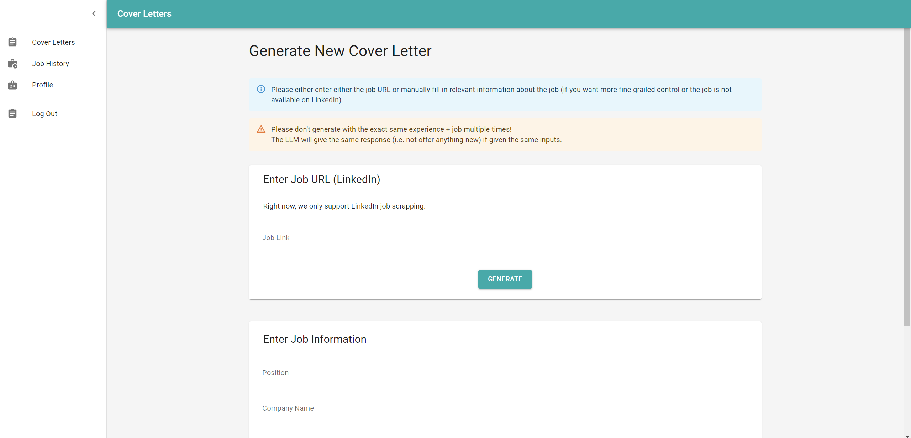
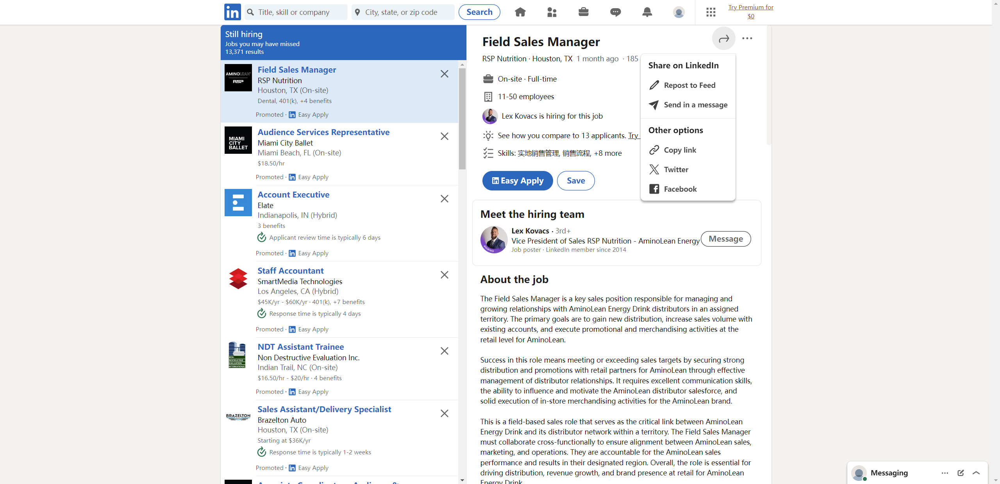

# jobGPT

jobGPT is an all-in-one solution for jobseekers! 

Keeping track of which jobs you have applied for in the past, jobGPT allows you to customize your dashboard with skills and past experiences. Then, provided with the job URL, it scraps relevant information from the job description and generates a succinct and professional cover letter tailored to the job and your personal history!

---

## Detailed Description

Cover letter generation has always been one of the most intricate parts of any job application. Some use the same one for every job; some have templates with minor adjustments; others ignore it altogether. Getting GPT to do it for you is also too much effort. Beside this annoyance,  one may also vex over keeping track of which job they have applied for. Many use their inbox to keep track - surely there’s a way to automate this, since we are engineers and creatives?

Fear not! With the power of Large Language Models and elegant frontend/backend integrations, we present jobGPT, an all-in-one solution where you may generate cover letters while also keeping track of which job you have applied for. The website allows users to create accounts, as well as updating it with their skills (e.g. Python, product management, etc) and past experiences (e.g. co-Founder, Apple Inc). Then, we offer the option to generate cover letters using information about the job (which the user can pass in either via the LinkedIn url, or manually copy and paste) leveraging the OpenAI API. 

We have a cool pipeline which creates vector stores for long pieces of texts such as the experience and job descriptions, and also a retriever which identifies the most relevant embeddings given the prompt. Our app is built using MERN stack, and keeps track of experience, job, skills and users with Mongoose models communicated with the FrontEnd through RESTful APIs and even CORS. We also have a search feature, beautiful filter pipeline, global state management and session-based authentication system to ensure the user experience is as smooth as humanly imaginable. We hope you enjoy using our web app.

# How to run

Make sure to run `yarn` every time after pull. 

(`npm install` also works, but need to do `npm install --force` for the backend)

(Note: If you are a Mac user and at the UCLA campus, please connect to UCLA_WIFI instead of UCLA_WEB.)

## LLM

- NOTE: LangChain only supports Node version >= 18. Make sure the node environment is supported with `node -v`. 

Within the LLM folder:

```
LLM/
├── examples/ (example PDFs for local parsing)
├── loadExperience.js (loading the resume or a list of user passed in experiences)
├── loadJob.js (loading the job from user link)
├── preprocessing.js (handles loading PDF/job description into documents, using a recursive character text splitter
├── main.js (main pipeline, involving 1. model/chain creation, 2. document loading, 3. storing template into chain, 4. generate embeddings/vector store, 5. retrieve docs from prompt, 6. call the chain
├── prompt.js (template for the prompt)
```

## Backend

First, add all required packages.

```
yarn
```

Then, check if the .env file is placed in the correct position (privately shared; at the level as index.js at the BackEnd folder).
To launch the server, run the command `npm run dev`. The server runs at `http://localhost:8080`.

```
npm run dev
```

```
BackEnd/
├── node_modules/
├── src/
│ ├── api/ (implement RESTful API calls for User, Job, CoverLetter, etc)
│ ├── db/ (connect to MongoDB database)
│ ├── LLM/ (LangChain backend with OpenAI API)
| |── models/ (define MongoDB Schema and Form)
├── index.js (configure CORS and middleware; registers for all API)
├── package.json (track dependencies)
├── yarn.lock (track dependencies)
├── .env (hidden for security purpose; contains connection to Database, and also OpenAI API KEY, etc.)
```
(How to get the .env file? Privately shared in the **comment** section under Project Source Code Submission Page at BruinLearn)


## Frontend

First, add all required packages.

```bash
yarn
```

Then, start the app which runs on `http://localhost:3000`.

```bash
npm start
```

```
FrontEnd/
├── node_modules/
├── src/
│ ├── components/ (reusable components for the webpages)
│ ├── pages/ (implement frontend pages, e.g. job history, generate new cover letter, personal profile)
│ ├── styles/ (customize Material-UI element styles)
│ ├── hooks/ (detect the session-cookie for security purpose)
│ ├── gadgets/ (define helper functions such as format DateTime and Validate Form)
│ ├── App.js
│ ├── index.js
|
├── public/
│ ├── index.html
│ └── favicon.ico (logo)
├── .gitignore
├── package.json
└── package-lock.json
```

## Job URL Directions

Use the top form on the "Cover Letters" page to generate without manual input for jobs on LinkedIn:



To obtain the correct format of LinkedIn job link for cover letter generation, go to https://www.linkedin.com/jobs/ and search for desired jobs:


Click on the desired job to enter detailed job page, press the share button on the top-right of the job window and select copy link to copy the correct format of job link to clipboard:



The job link should match the following regular expression in grep:

```bash
grep -E '^https://www\.linkedin\.com/jobs/view/[0-9]+$'
```

## Acknowledgments

* [MUI](https://mui.com)
* [LangChain](https://www.langchain.com/)
